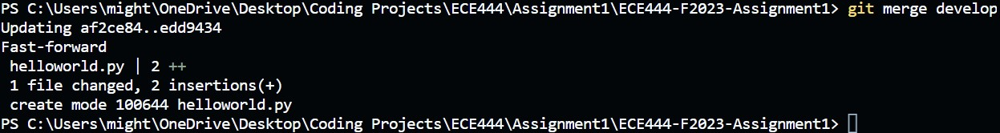
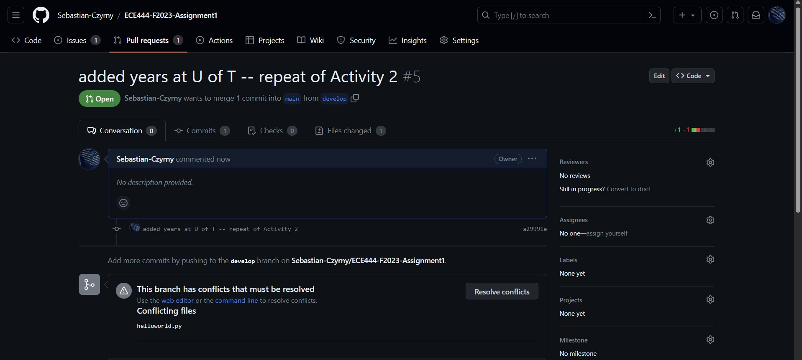
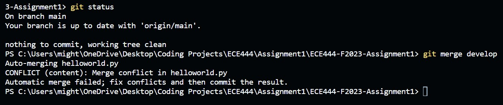
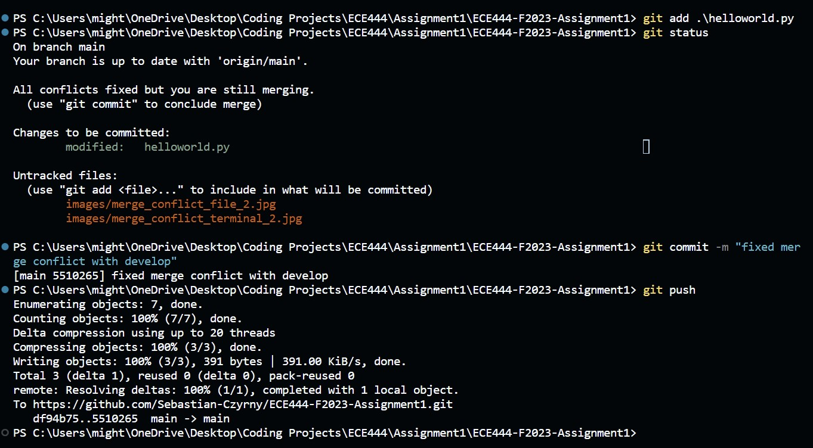
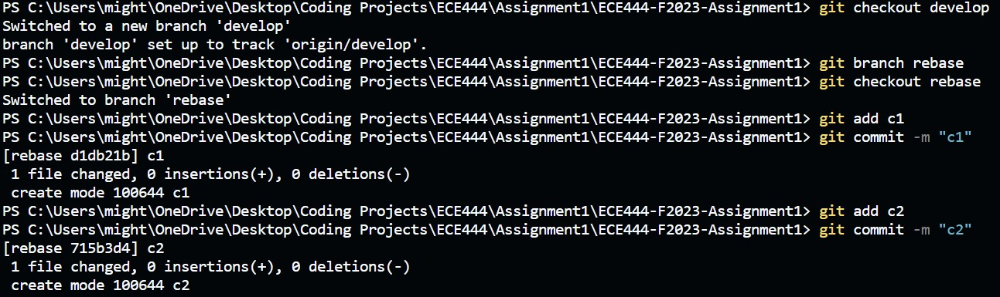
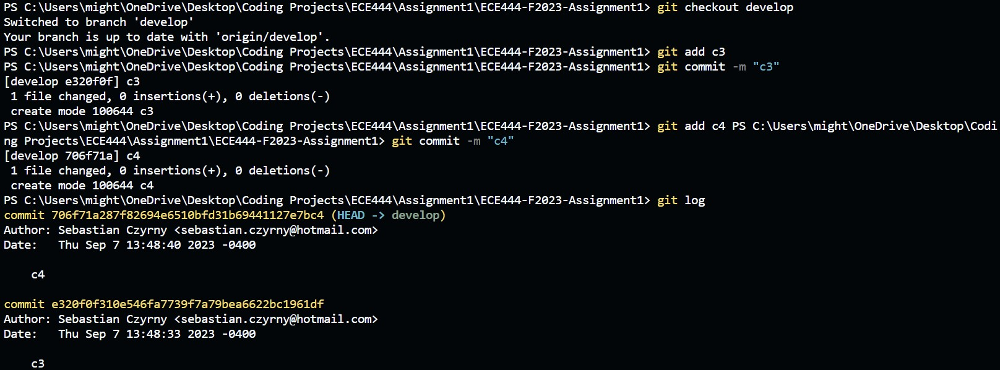
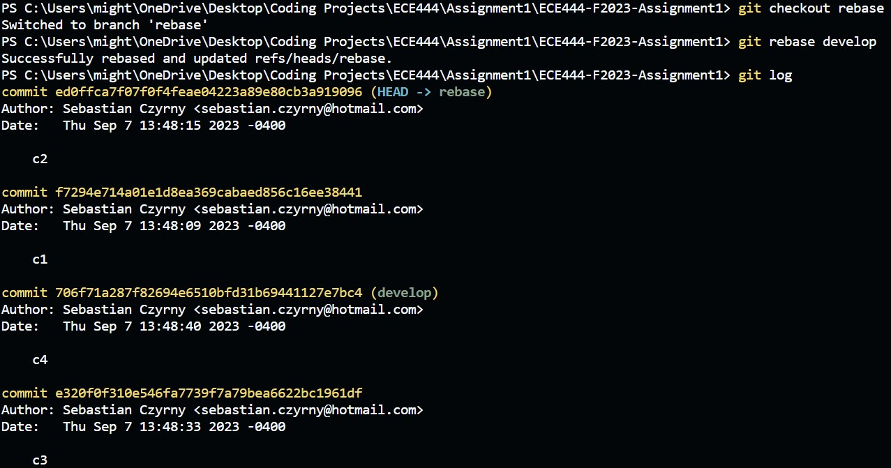
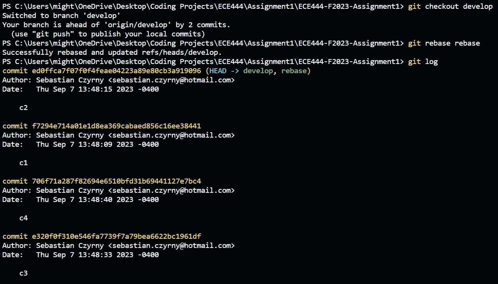

# Sebastian Kevin Czyrny

## Activity 1

Picture of Commit of README.md change to my name

## Activity 2

Picture of merge output

## Activity 3

Below picture depicts the merge conflict as seen on github

Below picture depicts merge conflict as seen from terminal

Below picture depicts merge conflict as seen from helloworld.py

Below picture depicts the terminal after the resolution of the conflicts

## Activity 4

Pictures of Commits for utils.py and utils_tests.py

## Activity 5

Pictures of rebase commands

1. Created branch rebase and created commits c1 and c2

    

2. Moved back onto branch develop and created commits c3 and c4

    

3. Moved back onto branch rebase and rebased against branch develop

    

4. Moved back onto branch develop and rebased branch rebase onto branch develop

    
